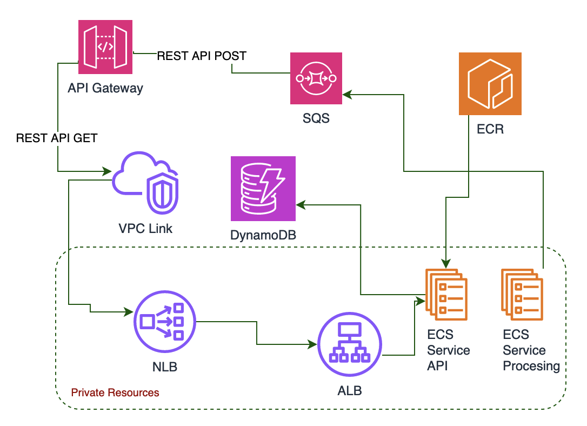

# What is AWS API Gateway VPC Link?

AWS API Gateway VPC Link allows you to connect your AWS API Gateway with resources in your private VPC (Virtual Private Cloud). This enables your API Gateway to route requests to private VPC resources like EC2 instances, Elastic Load Balancers, and others, without exposing them to the public internet.

## Sample Architecture Using AWS API Gateway VPC Link

Let’s illustrate this with a sample architecture: 

### 1. API Gateway for REST APIs:
- **The first API** is a direct integration with Amazon Simple Queue Service (SQS). This setup allows for efficient message queuing and processing.
- **The second REST API** is designed for an Elastic Container Service (ECS) application. Here's where the VPC Link plays a crucial role.

### 2. Using VPC Link for ECS Service:
- The VPC Link is set up to forward traffic to a Network Load Balancer (NLB).
- This NLB then forwards the request to an Application Load Balancer (ALB).
- The ALB has the ECS service as its target. This design ensures that the ECS service, although hosted within a private network, is accessible through the API Gateway, maintaining a high level of security and performance.

### 3. Processing ECS Service:
- This service is responsible for processing messages.
- It retrieves messages from Amazon Simple Queue Service (SQS) and processes them as needed.
- After processing, it stores the results in Amazon DynamoDB, a fast and flexible NoSQL database service.

### 4. API Service Exposed via VPC Link:
- The second component is the API service, which is exposed to the outside world through the VPC Link.
- This service interacts with DynamoDB to retrieve data.
- The API Gateway, connected via the VPC Link, routes incoming requests to the API service.
- The API service fetches the required data from DynamoDB and returns it in response to the API requests.

## Prerequisites for Terraform Implementation

Before diving into the Terraform code to set up your architecture, there are some essential prerequisites to ensure everything runs smoothly:

### 1. ECS Repositories Preparation:
- Ensure you have ECS repositories for your API and processing ECS services.
- You can create these repositories by executing the Terraform code provided in the ecr folder within the terraform directory. This step is crucial for managing your container images for the ECS services.

### 2. ACM Certificates:
- Obtain ACM (AWS Certificate Manager) certificates for your domain.
- These certificates should be specified in the terraform.tfvars file. ACM certificates are vital for securing your API Gateway and Load Balancer communications using SSL/TLS.

### 3. VPC Configuration:
- You should have a VPC set up with 2 public and 2 private subnets.
- The public subnets must be tagged with tier=public, and the private subnets with tier=private. This VPC configuration is crucial for ensuring that the networking for your AWS resources is properly isolated and organized, aligning with best practices for security and efficiency.

## Implementation Using Terraform

To bring this architecture to life, we provide a comprehensive Terraform code implementation. This code will help you set up:
- **API Gateway APIs**: Configurations for both direct SQS integration and ECS service via VPC Link.
- **ECS Cluster and Services**: The backbone of your containerized application environment.
- **IAM Roles**: Necessary roles for secure and efficient AWS service interactions.
- **DynamoDB**: A managed NoSQL database service for all your application's database needs.
- **SQS**: For message queuing to decouple and scale microservices, distributed systems, and serverless applications.
- **VPC Link**: To securely connect your API Gateway with your VPC resources.
